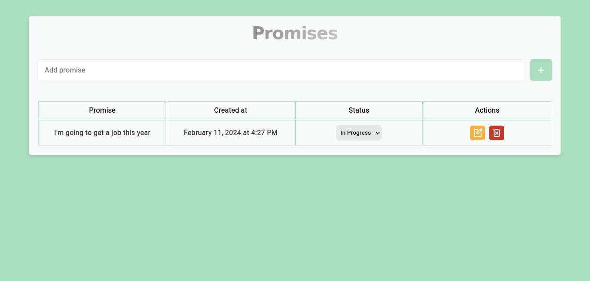
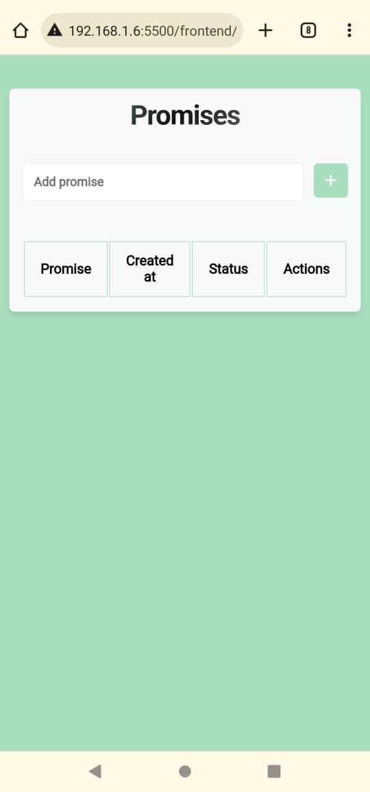

<p align="center"></p>

This small project is a comprehensive full stack with a focus on promises. Every time the year comes to an end and a new one begins, we make our promises and try to fulfill them throughout the year. So, the project Promises is here to help us with our promises and dreams!

## Table of contents:

- [**Technologies**](#technologies)
    - [Tools](#tools)
    - [Backend](#backend)
    - [Frontend](#frontend)
    - [Database](#database)
- [**How to use**](#how-to-use)
- [Endpoints](#endpoints)

## **Technologies**:

### **Tools**
---
<p align="left">  
  <a href="https://skillicons.dev">
    
  </a>
</p>
<p align="left">
<code>vscode</code>
<code>docker</code>
<code>bash</code>
<code>git</code>
</p>

### **Backend**
---
<p align="left">  
  <a href="https://skillicons.dev">
    
  </a>
</p>
<p align="left">
<code>javascript</code>
<code>nodejs</code>
<code>express</code>
</p>

### **Frontend**
---
<p align="left">  
  <a href="https://skillicons.dev">
    
  </a>
</p>
<p align="left">
<code>javascript</code>
<code>css</code>
<code>html</code>
</p>


### **Database**
---

<p align="left">  
  <a href="https://skillicons.dev">
    
  </a>
</p>
<code>mysql</code>

### **How to use**

#### Clone the repository
```
$git clone git@github.com:adrieleprimo/Promises.git
```
#### Create a database
```
$ CREATE DATABASE database_name;
```
#### Create table
```
$ CREATE TABLE promises(
    id INT PRIMARY KEY AUTO_INCREMENT,
    title VARCHAR(45) NOT NULL,
    status VARCHAR(45) NOT NULL,
    created_at VARCHAR(45) NOT NULL
);
```
#### Connection
```
PORT=
MYSQL_HOST=
MYSQL_PORT=
MYSQL_USER=
MYSQL_PASSWORD=
MYSQL_DB=
```
#### Install the node_modules
```
$ npm install
```

#### Start
```
$ npm run dev
```
----

#### Backend
##### Endpoints

<code> **GET** **/promises**</code>

Actually, with this route you can see all promises.

##### Sample requisition:

```javascript
// GET /promises
//no body
```
##### Sample answer:

``` javascript
Status: 200
[
	{
		"id": 1,
		"title": " A new begin",
		"status": "in progress",
		"created_at": "Tue, 30 Jan 2024 20:32:31 GMT"
	}
]
```
---
<code> **POST** **/promises**</code>

With this route, we can create a new promise. So, *every promise created by default will have pending status*.

##### Sample requsition:

``` javascript
// POST /promises
// body:
  - title
```
##### Sample answer:

``` javascript
Status: 201
{
	"insertId": 1
}
```
---
<code> **PUT** **/promises/:id**</code>

With this route, we can update a promise.

##### Sample requsition:

``` javascript
// PUT /promises/:id
// body:
  - title;
  - status;
```
##### Sample answer:

``` javascript
Status: 204 
//no body
```
---
<code> **DELETE** **/promises/:id**</code>

With this route, we can delete a promise.

##### Sample requsition:

``` javascript
// DELETE /promises/:id
```
##### Sample answer:

``` javascript
Status: 204
//no body
```
---

#### Frontend
Here we will have the entire visual part of the Promises project. Registering your objectives. It's very simple.

<code> Computer screen</code>
<p align="center"></p>

<code> Mobile screen</code>
<p align="center"></p>